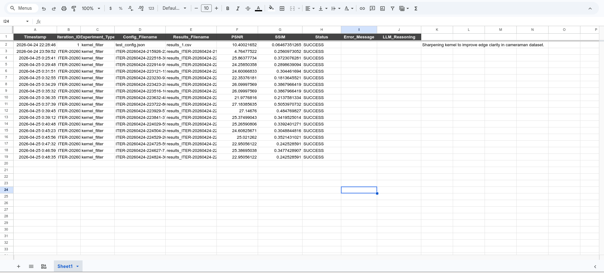
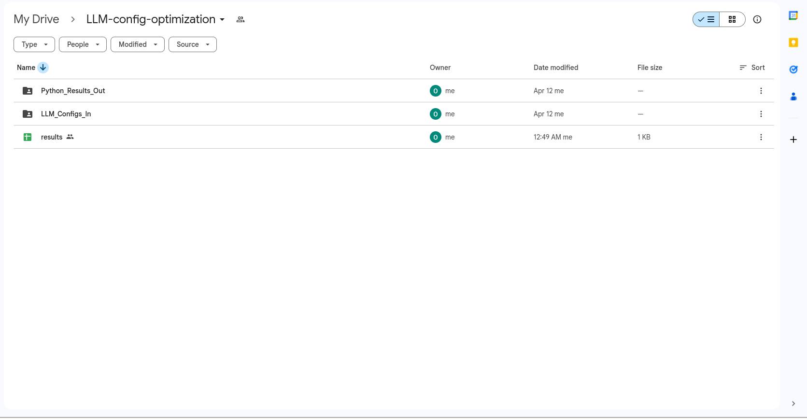
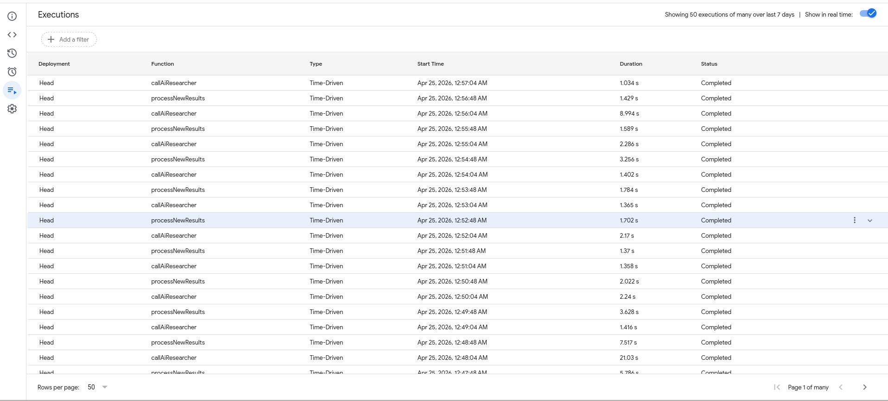
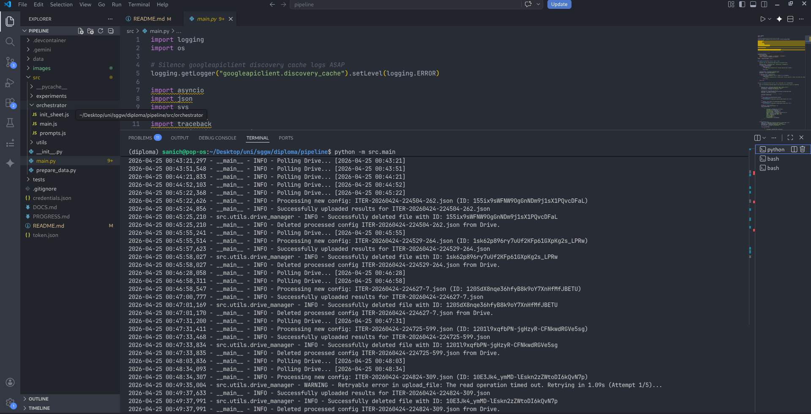

# LLM-Driven Autonomous Pipeline for Mathematical Image Filter Optimization


An autonomous "AI Researcher" system that iteratively optimizes mathematical convolution kernels to restore noisy images. The system uses a Large Language Model (LLM) as a heuristic search engine to propose filters, which are then tested by a modular Python compute node.

## 1. Project Purpose
This project explores the application of **Agentic Workflows** to classical computer vision tasks. Instead of manually tweaking image filters, this system creates a closed-loop feedback cycle:
- **Heuristic Search:** An LLM (Gemini 3 Flash Preview) hypothesizes which mathematical matrices will best suppress noise while preserving edges.
- **Automated Validation:** A Python compute node executes these hypotheses on standardized datasets and reports quantitative performance (PSNR/SSIM).
- **Continuous Improvement:** Results are fed back into the LLM's "memory," allowing it to learn from previous successes and failures.

## 2. Technologies Used
- **Python 3.13:** Core execution engine for image processing.
- **OpenCV & Scikit-Image:** Mathematical operations and metric calculations.
- **Google Apps Script (GAS):** Cloud-based orchestrator managing the API loop.
- **Google Drive API:** Asynchronous data bridge for config/result exchange.
- **Google Sheets:** Real-time dashboard and historical data storage.
- **Gemini 3 Flash Preview:** The cognitive engine driving the filter optimization.

---

## 3. System Architecture & Workflow

The pipeline operates in a 4-stage cycle:

1.  **Hypothesis:** The LLM proposes a new $N \times N$ kernel matrix based on the "Hall of Fame" (top-performing historical filters).
2.  **Orchestration:** Google Apps Script drops the proposal into the `LLM_Configs_In` folder on Google Drive.
3.  **Experiment:** The local Python node detects the file, corrupts a clean image with Gaussian noise, applies the LLM's filter, and uploads the results.
4.  **Analysis:** GAS ingests the results into the Master Tracker sheet and triggers the next iteration.









---

## 4. Project Structure
```text
pipeline/
├── src/
│   ├── experiments/       # Modular experiment registry (KernelFilter logic)
│   ├── orchestrator/      # Google Apps Script (.js) and LLM Prompts
│   ├── utils/             # Drive I/O, Data Loading, and Metrics helpers
│   └── main.py            # Async compute node polling loop
├── data/
│   └── raw/               # Ground truth datasets (Cameraman, MedMNIST)
├── tests/                 # Smoke tests for architectural integrity
├── README.md              # Project documentation
```

---

## 5. Installation & Setup

### Prerequisites
- Conda or a Python 3.10+ environment.
- A Google Cloud Project with the **Google Drive API** **Google Sheets API** **Apps Script API** enabled.
- A **Gemini API Key** from [Google AI Studio](https://aistudio.google.com/).

### Step 1: Python Compute Node
```bash
# Create and activate environment
conda create -n config_opt python=3.13
conda activate config_opt

# Install dependencies
pip install opencv-python numpy pandas scikit-image google-api-python-client google-auth-httplib2 google-auth-oauthlib medmnist
```

### Step 2: Authentication
1.  Obtain your `credentials.json` from the Google Cloud Console (OAuth 2.0 Desktop app).
2.  Place it in the project root.
3.  Run `python tests/test_drive_auth.py` to authorize and generate `token.json`.

### Step 3: Cloud Orchestrator
1.  Open a Google Sheet.
2.  Go to `Extensions > Apps Script`.
3.  Copy the files from `src/orchestrator/` into the editor.
4.  Add your `GEMINI_API_KEY` to **Project Settings > Script Properties**.
5.  Run `initializeMasterTrackerHeaders()` once.

---

## 6. Usage

1.  **Start the Body (Python):**
    ```bash
    python -m src.main
    ```
    The node will enter a persistent polling state, checking for new configurations every 30 seconds.

2.  **Enable the Heartbeat (GAS):**
    - In the Apps Script editor, set a **Time-driven trigger** for the `orchestrate` function to run every 1 minute.
    - Alternatively, run `orchestrate()` manually to start the first loop.

> **[INSERT IMAGE: Google Sheets screenshot showing the PSNR/SSIM metrics and LLM reasoning]**

---

## 7. Key Features
- **Plug-and-Play Architecture:** The Python node uses a `Registry` pattern, allowing new experiment types (e.g., SciPy optimization or PyTorch models) to be added without changing the core loop.
- **Hallucination Guard:** GAS logic detects malformed LLM responses and automatically triggers a refined "fallback" retry.
- **Atomic Operations:** Local files are managed within `tempfile` directories to ensure zero system pollution and robust cleanup.
- **Idempotent Logging:** The system verifies `Iteration_ID` before appending to the sheet, preventing duplicates.

---

## 8. License
# Copyright (c) 2026 Oleksandr Babenkov
# All Rights Reserved